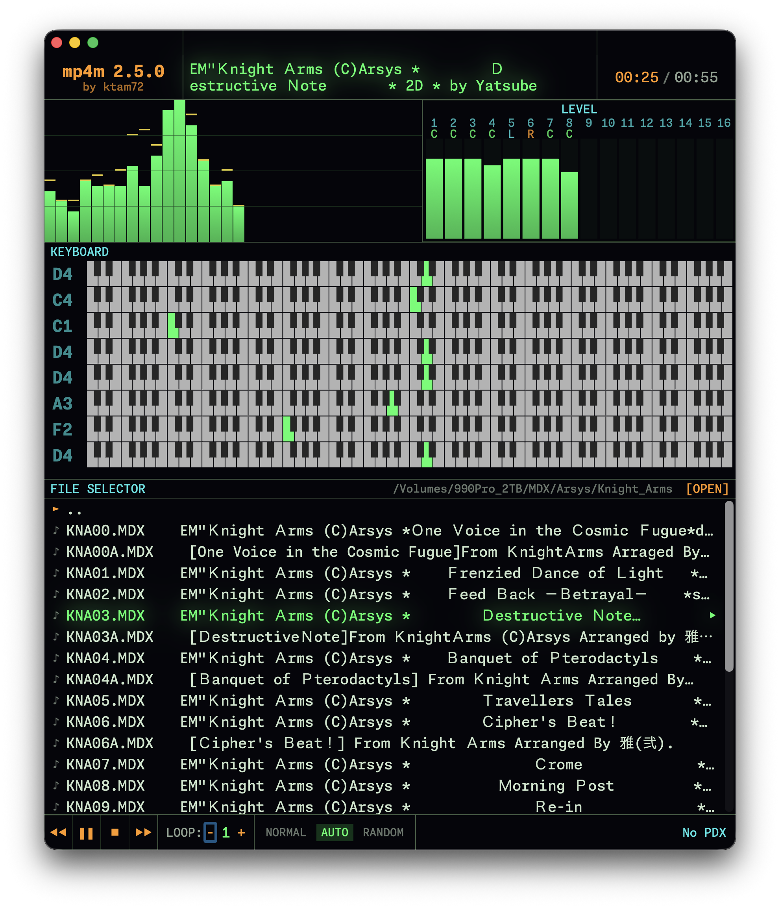

# MP4M — MDX Player for macOS

macOS向けのMDXプレイヤーです。


## 特徴

- **MDX/PDX サポート** — X68000 OPM FM 音源 + ADPCM サンプルの再生（pcm8対応）
- **リアルタイム可視化** — 32バースペアナ（ピーク保持）・16chレベルメーター・パン表示
- **ピアノキーボード表示** — FM 8ch 発音状態をピアノキーボード上に可視化
- **CLI引数サポート** — バイナリ直接実行時に `--file=<path>` / `--dir=<path>` でパスを指定可能（単一インスタンス制御・IPC転送付き）

## インストール

### ソースからビルド

```bash
cd MP4M
xcodegen generate
xcodebuild -project MP4M.xcodeproj -scheme MP4M -configuration Release -sdk macosx clean analyze build
cp -R "DerivedData/MP4M-*/Build/Products/Release/MP4M.app" /Applications/
```

## App Store 配布について

**当プロジェクトは X68000 フリーウェアの著作権者を尊重し、App Store での配布を予定していません。**

   -  GAMDX（MXDRVG、pcm8、x68pcm8）など X68000 時代のフリーウェア資産を活用しており、これらの著作権者（GORRY氏、milk氏、K.MAEKAWA氏、m_puusan氏、Yosshin氏、Missy.M氏、Yatsube氏 等）のライセンス条項遵守を優先

## CLI からの起動

MP4M はバイナリ直接実行時に `--file=` / `--dir=` 形式のコマンドライン引数でファイルを指定できます。`open` コマンドは通常の GUI 起動時に使用します。

```bash
# MDXファイルを指定して開く（自動再生）
/Applications/MP4M.app/Contents/MacOS/MP4M --file=/path/to/song.mdx

# ディレクトリをルートフォルダとして開く
/Applications/MP4M.app/Contents/MacOS/MP4M --dir=/path/to/mdx/files
```

> **`--file=` / `--dir=` プレフィックス必須**。生のパス引数 (`/path/file.mdx`) は macOS AppKit が argv を自動開封しようとしてウィンドウ生成に失敗する場合があるため使用しないでください。

MP4M は**単一インスタンス**で動作します。既に起動中の場合は、新たに指定されたファイルパスが既存のウィンドウに転送され、前面に表示されて再生が開始されます（新規プロセスは自動終了）。

## 使い方

1. **フォルダを開く**：FILE SELECTOR の右端にある「[OPEN]」ボタンをクリックし、MDX ファイルが格納されたフォルダを選択
2. **ファイルを選択**：リストから再生したい MDX ファイルを選択
3. **再生**：「▶」ボタンで再生開始（曲名をダブルクリックでも再生開始する）
4. **チャンネルミュート**：LEVELメーターのチャンネル番号をダブルクリックでミュート/ミュート解除
5. **オートモード**：「NORMAL」「AUTO」「RANDOM」で自動再生モード切り替え

### オートモード（ファイル終了時の動作）

ファイルの再生完了時の動作を選択できます：

| モード | 動作 | 用途 |
|--------|------|------|
| **NORMAL** | 再生完了 → フェードアウト → **停止** | 1曲ずつ手動で選択して再生したい場合 |
| **AUTO** | 再生完了 → フェードアウト → **次のファイル自動再生** | ファイルリスト順に連続再生したい場合 |
| **RANDOM** | 再生完了 → フェードアウト → **ランダムなファイル再生** | ファイルリストからランダムに再生したい場合 |

### マウス操作

| 操作 | 機能 |
|------|------|
| 再生ボタンクリック | 再生/一時停止 |
| 曲名ダブルクリック | 同上　 |
| 前/次ボタンクリック | 前の曲 / 次の曲 |
| チャンネル番号ダブルクリック | チャンネルミュート |

### ファイル形式

- **MDX** — MXDRV 形式 (X68000 OPM FM 音源)
- **PDX** — ADPCM サンプルデータ (MDX と同ディレクトリに配置で自動ロード)


## 関連プロジェクト

**MDX プレーヤー（UI参考）**
- [mmdsp](https://github.com/gaolay/MMDSP) — X68000 時代のグラフィカル MDX プレーヤー
- [MDXPlayer](https://github.com/asaday/MDXPlayer) — iOS 向け MDX プレーヤー

**技術基盤**
- [ymfm](https://github.com/aaronsgiles/ymfm) — YM2151/OPM FM エミュレーター
- [fmgen](https://github.com/kichikuou/fmgen) — YM2151/OPM FM エミュレーター
- [GAMDX](https://gorry.haun.org/android/gamdx/) — Android MDX プレーヤー（MXDRVG、pcm8/x68pcm8 公式リポジトリ）


お気づきの点がありましたらフィードバックいただけるとありがたいです。


