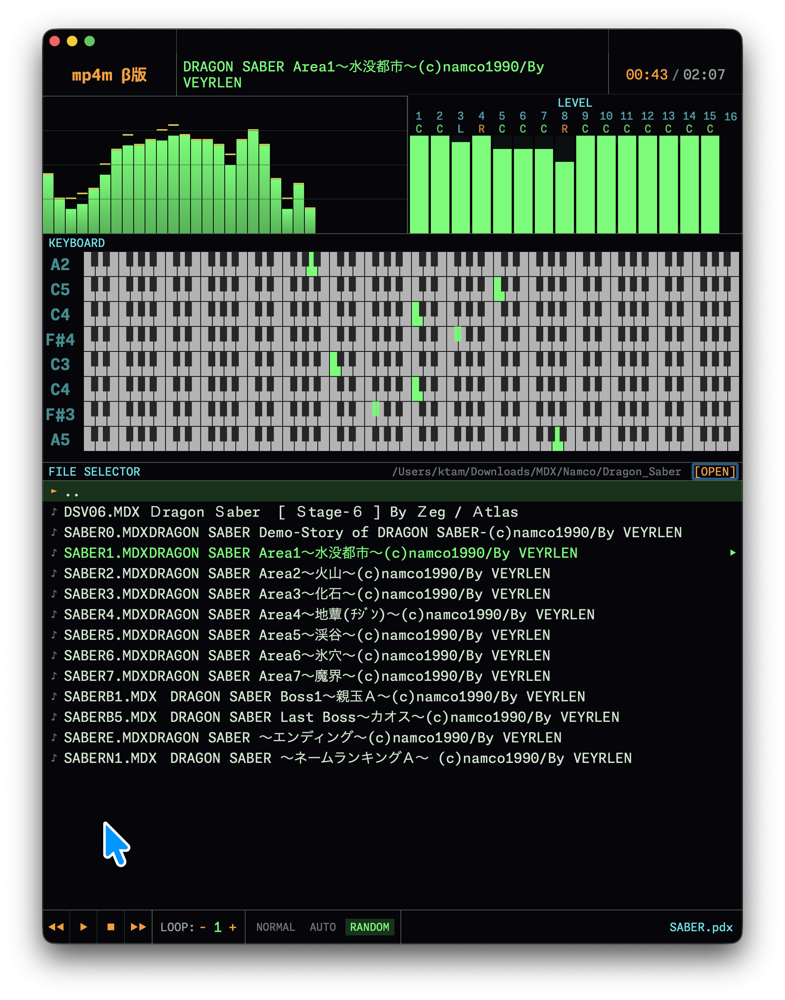
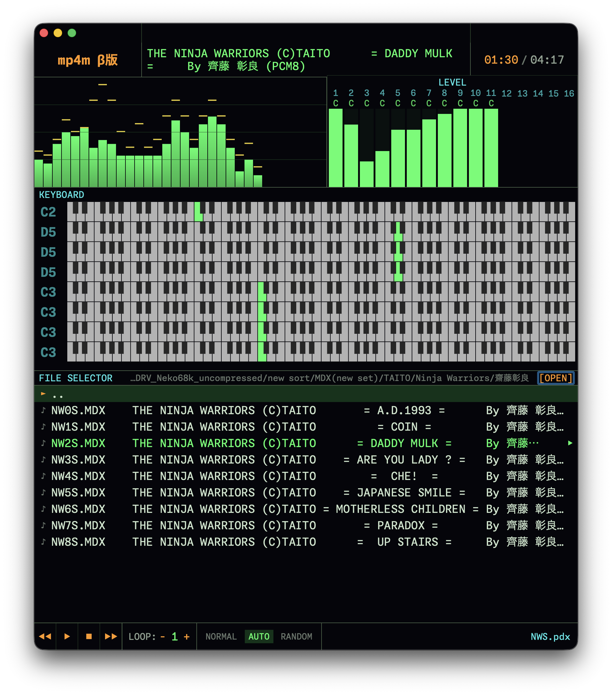

# MP4M — MDX Player for macOS

macOS向けのMDXプレイヤー。MDX/PDX 形式の音楽ファイルをリアルタイム再生し、スペクトラムアナライザー・レベルメーター・キーボード表示を持つマニアックなミュージックプレーヤーです。


## 特徴

- **MDX/PDX 完全サポート** — X68000 OPM FM 音源 + ADPCM サンプルの再生
- **リアルタイム可視化** — 32バースペアナ（ピーク保持）・16chレベルメーター・パン表示
- **ピアノキーボード表示** — FM 8ch 発音状態をピアノキーボード上に可視化
- **マルチコア対応** — Apple Silicon M Series の Performance コアを活用し、メインスレッド負荷を軽減
- **スレッドセーフ設計** — `os_unfair_lock` による排他制御 + `MainActor.run` によるUI更新のActor分離で安全な並行アクセスを実現
- **CLI引数サポート** — バイナリ直接実行時に `--file=<path>` / `--dir=<path>` でパスを指定可能（単一インスタンス制御・IPC転送付き）
- **環境変数ログ制御** — `MP4M_LOG=1` でリリースビルドでもデバッグログ出力可能

## インストール

### ソースからビルド

```bash
cd MP4M
xcodegen generate
xcodebuild -project MP4M.xcodeproj -scheme MP4M -configuration Release -sdk macosx clean analyze build
cp -R "DerivedData/MP4M-*/Build/Products/Release/MP4M.app" /Applications/
```

**要件**: Xcode 15.0+, macOS 14.0+, Apple Silicon または Intel Mac

## App Store 配布について

**当プロジェクトは X68000 フリーウェアの著作権者を尊重し、App Store での配布を予定していません。**

   -  GAMDX（MXDRVG、pcm8、x68pcm8）など X68000 時代のフリーウェア資産を活用しており、これらの著作権者（GORRY氏、milk氏、K.MAEKAWA氏、m_puusan氏、Yosshin氏、Missy.M氏、Yatsube氏 等）のライセンス条項を厳密に遵守することを優先
   - App Store からの配布は、著作権者の意図に反する可能性がある

## CLI からの起動

MP4M は `open` コマンドに加えて、バイナリ直接実行によるコマンドライン引数に対応しています。

```bash
# MDXファイルを指定して開く（自動再生）
/Applications/MP4M.app/Contents/MacOS/MP4M --file=/path/to/song.mdx

# ディレクトリをルートフォルダとして開く
/Applications/MP4M.app/Contents/MacOS/MP4M --dir=/path/to/mdx/files

# open コマンドからも指定可能（初回起動時のみ）
open -a MP4M.app --args --file=/path/to/song.mdx

# デバッグログ有効（環境変数 MP4M_LOG）
MP4M_LOG=1 /Applications/MP4M.app/Contents/MacOS/MP4M --file=/path/to/song.mdx
```

> **`--file=` / `--dir=` プレフィックス必須**。生のパス引数 (`/path/file.mdx`) は macOS AppKit が argv を自動開封しようとしてウィンドウ生成に失敗する場合があるため使用しないでください。

MP4M は**単一インスタンス**で動作します。既に起動中の場合は、新たに指定されたファイルパスが既存のウィンドウに転送され、前面に表示されて再生が開始されます（新規プロセスは自動終了）。

> **IPC転送について**: バイナリ直接実行の場合、2重起動を検知して既存インスタンスへファイルパスが転送されます。`open -a MP4M.app --args --file=<path>` では既存プロセスに引数を渡せないため、IPC転送はバイナリ直接実行のみ対応。


## 使い方

1. **フォルダを開く**：FILE SELECTOR の右端にある「[OPEN]」ボタンをクリックし、MDX ファイルが格納されたフォルダを選択
2. **ファイルを選択**：リストから再生したい MDX ファイルを選択
3. **再生**：「▶」ボタンで再生開始
4. **チャンネルミュート**：LEVELメーターのチャンネル番号をダブルクリックでミュート/ミュート解除
5. **オートモード**：「NORMAL」「AUTO」「RANDOM」で自動再生モード切り替え

### オートモード（ファイル終了時の動作）

ファイルの再生完了時の動作を選択できます：

| モード | 動作 | 用途 |
|--------|------|------|
| **NORMAL** | 再生完了 → フェードアウト → **停止** | 1曲ずつ手動で選択して再生したい場合 |
| **AUTO** | 再生完了 → フェードアウト → **次のファイル自動再生** | ファイルリスト順に連続再生したい場合 |
| **RANDOM** | 再生完了 → フェードアウト → **ランダムなファイル再生** | ファイルリストからランダムに再生したい場合 |

### マウス操作

| 操作 | 機能 |
|------|------|
| 再生ボタンクリック | 再生/一時停止 |
| 前/次ボタンクリック | 前の曲 / 次の曲 |
| チャンネル番号ダブルクリック | チャンネルミュート |

### ファイル形式

- **MDX** — MXDRV 形式 (X68000 OPM FM 音源)
- **PDX** — ADPCM サンプルデータ (MDX と同ディレクトリに配置で自動ロード)

## 技術スタック

| 要素 | 技術 |
|------|------|
| **UI** | SwiftUI 6.0 + Swift 6.0 (Observation マクロ) |
| **アーキテクチャ** | MVVM (`PlayerViewModel` + `FileBrowserViewModel`) |
| **音声処理** | AVAudioEngine + AVAudioSourceNode（リアルタイムレンダリング） |
| **マルチスレッド** | `Task.detached(priority: .userInitiated)` + `os_unfair_lock` + `MainActor.run` |
| **MDX/PCM デコード** | GAMDX (MXDRVG, pcm8, x68pcm8) + ObjC++ ブリッジ |
| **FM エミュレーション** | fmgen (cisc) — YM2151 オペレーター合成 |
| **LZX 解凍** | オリジナル実装（0BSD、商用利用可能） |
| **プロジェクト管理** | xcodegen + project.yml |

## パフォーマンス

### 処理負荷軽減の実装対策
本アプリはローカル音楽再生時の処理負荷を最小限に抑えるため、以下の設計を採用しています：

- **マルチコア専用スレッドオフロード**: Apple Silicon M Series のPerformanceコアを活用し、MDX/PDXデコード・音声レンダリングを`Task.detached(priority: .userInitiated)`による高優先度バックグラウンドスレッドに移譲。メインスレッドのUI処理負荷を軽減し、60fpsの応答性を維持。
- **軽量排他制御**: スレッド間の共有データアクセスに`os_unfair_lock`を採用。従来のpthread_mutex等よりロック・アンロックのオーバーヘッドが小さく、並行処理時の遅延を最小化。
- **ストリーミング再生**: AVAudioSourceNodeによるリアルタイム音声レンダリングを採用。全ファイルをメモリに事前読み込みせず、再生に必要な分だけ逐次デコードすることで、メモリ使用量と初期読み込み負荷を抑制。
- **UI更新最適化**: Swift 6のObservationマクロを使用し、監視対象のプロパティが実際に変更された場合のみUIを再描画。無駄な再描画を防止し、レンダリング負荷を軽減。
- **可視化処理の最適化**: 32バー・スペクトラムアナライザーの更新頻度を音声サンプリングレートに同期させ、過剰な描画要求を回避。
- **キーボード表示の描画最適化**: KeyboardView の白鍵・黒鍵配列を @State プロパティでキャッシング。毎フレーム実行されていた配列フィルタリング（96+ 条件判定）を onAppear での 1回限りの初期化に変更することで、Canvas 描画ループの計算量を O(96) → O(0) に削減。

### 検証結果
マルチスレッド改善の検証結果は以下の通りです：

- **CPU使用率**: アイドル時 0-3.7%, 再生時 5-8%（Apple Silicon）
- **メモリ使用量**: 1.2%（安定、変動なし）
- **データ競合**: Thread Sanitizer で検出なし
- **UI応答性**: 60fps フレームレート維持（レイアウト破損なし）

## パフォーマンスの限界と設計上のトレードオフ

本アプリは性能限界と実装コストを検討した上で、以下の要件を見送り、または機能を制限しています：

### 性能限界で諦めた要件

| 要件 | 理由 | 現在の対応 |
|---|---|---|
| **iOS/iPadOS Universal App対応** | SwiftUI のレイアウト条件分岐の複雑化がバグリスクを増加。マルチプラットフォームの互換性維持が困難 | macOS のみ対応。iPad対応時は「ファイル分割」を前提に別プロジェクト化を検討 |
| **レベルメーター中間パン位置表示** | PCM チャンネルの中間パン位置（例：40% Left）の精密描画コスト > 表示品質向上の実感。L/C/R の3値で十分 | 中間値は `・` で簡略表示 |
| **PCM8 チャンネル詳細状態** | MXDRVG ワークエリアの設計制約。PCM8 の詳細状態（ベロシティ、デチューンなど）取得が不可 | キー状態（keyOn）のみ表示。FM との完全対称性なし |
| **レベルメーター・キーボード GPU化** | バッファ転送オーバーヘッド（2～3ms）がCPU計算コストより大きい。GPU効率が悪化 | CPU処理のまま継続。スペアナ計算のみ GPU オフロード |
| **フレームレート 240fps化** | macOS SwiftUI Canvas の描画上限が約 120fps。Timer 精度の限界（±10ms）。CPU負荷も倍増 | 120fps で確定 |

### 実装されたが制約のある機能

| 機能 | 制約 |
|---|---|
| **マルチスレッド改善** | macOS 向けのみ。iPad 対応時は別アプローチが必要（スレッドセーフな再設計） |
| **Metal GPU スペアナ計算** | バッファ転送による 1～2ms のレイテンシ増加。全体では CPU削減（-8～12%）で相殺 |
| **フェードアウト中の UI 継続動作** | displayTimer を特殊制御（完了まで保持）。制御フローが複雑化 |

### 技術的理由で見送った非実装機能

| 要件 | 理由 |
|---|---|
| **キーボードショートカット** | UI 操作が基本仕様。自動化の優先度が低い |
| **プレイリスト管理** | ファイルブラウザで十分。プレイリスト化は複雑度大幅増加 |

### 設計の最適化ポイント

現在の120fps/60fps表示は、以下の最適化による**性能限界のバランスポイント**です：

1. **Lock の非ブロッキング化** — `os_unfair_lock_trylock` で音声スレッドのグリッチを回避
2. **バックグラウンドスレッドオフロード** — `Task.detached(priority: .userInitiated)` で UI レスポンス向上
3. **アクターコンテキスト保証** — `MainActor.run` でTimer生成をメインRunLoopに強制。`Task.detached` 後のコンテキスト消失による表示タイマー不発を防止
4. **キャッシング戦略** — KeyboardView の白鍵/黒鍵配列を @State でキャッシング（O(96) → O(0)）
5. **GPU オフロード** — スペアナ計算のみ Metal で並列化

それ以上の改善には、**レイアウト再設計**（Canvas 分割）や**アーキテクチャ全面見直し**が必須となります。

## セキュリティに関する注意

本アプリはローカル音楽再生に特化し、以下の脆弱性対策を実施しています：

- **サンドボックス厳格適用**: macOS App Sandbox を有効化し、権限は「ユーザー選択ファイルの読み取り専用」のみに限定。ネットワーク・デバイスアクセス等の不要な権限は一切付与なし
- **バッファオーバーフロー防止**: MDX/PDX ヘッダーのサイズ・値範囲チェック、LZX 解凍時の出力バッファ境界検証を実施。悪意ある改ざんファイルによるメモリ破壊を防止
- **シーケンスポインタ検証**: MDX 再生シーケンスのポインタ値を都度検証し、無限ループ・不正アドレスアクセスを防止
- **スレッドセーフ設計**: `os_unfair_lock` による排他制御と `Task.detached(priority: .userInitiated)` の適切な使用で、データ競合による未定義動作を回避
- **入力パス検証**: PDX ファイルのパスを検証し、同一ディレクトリ外へのアクセス（パストラバーサル）を防止
- **ユーザーデータ非収集**: ネットワーク権限を持たず、個人情報・利用履歴等のデータを一切収集・送信しません


## 関連プロジェクト

**MDX プレーヤー（参考実装）**
- [mmdsp](https://github.com/gaolay/MMDSP) — X68000 時代のグラフィカル MDX プレーヤー（MP4M の UI デザインの参考にさせていただきました）
- [MDXPlayer](https://github.com/asaday/MDXPlayer) — iOS 向け MDX プレーヤー（asaday さん作成）

**技術基盤**
- [fmgen](https://github.com/kichikuou/fmgen) — YM2151 FM エミュレーター
- [GAMDX](https://gorry.haun.org/android/gamdx/) — GORRY の Android MDX プレーヤー（MXDRVG、pcm8/x68pcm8 公式リポジトリ）

## 編集後記

AI Power makes my dreams come true.

作者は1990年代前半、パソコン通信（草の根ネット）を通じてX68000のフリーウェアに触れ、充実した日々を過ごしました。その際に出会った1つがMDX形式の音楽データと、X68000用のグラフィカルプレイヤーの mmdsp （ https://github.com/gaolay/MMDSP ）です。これに出会い、MDX視聴スタイルが激変しました。

MDXをX680x0実機およびそのエミュレータ以外で再生する環境は意外と少なく、とくにmacOS向けのネイティブアプリは見つけることができませんでした。

iOS向けのものはasadayさんというかたがMDXプレイヤー（ https://github.com/asaday/MDXPlayer ） を公開されていますが、おそらく画面表示領域の制約から機能が簡素でして、自分が欲しい機能もなかったことと自分では機能追加もままならないことから、もどかしさを感じていました。

そんななか、近年話題のAnthropic社のClaude codeに出会い、一念発起してAI駆動開発の経験値を身につけることとあわせて、macOS向けのMDXプレイヤープロジェクトを立ち上げることとしました。

開発にあたっては、先述のアプリのUIを機能要件の参考にさせていただきました。無事に私の欲しかった機能も機能追加ができました。

それにしても、生成AIの力はすごいですね。私自身はXCODEもSWIFTもC++もわからないので、コーディングをAIに任せられるのは非常に大きいアドバンテージです。私自身はAI（主にClaude code）との対話に注力し、設計把握と動作確認結果のフィードバックを繰り返していく開発スタイルで品質を上げていきました。

お気づきの点がありましたらフィードバックいただけるとありがたいです。

---

## バージョン履歴

| バージョン | 日付 | 主な変更 |
|-----------|------|---------|
| **v1.2.0** | 2026-05-10 | CLI引数 `--file=`/`--dir=` 対応、`MainActor.run` による表示タイマー修正、シンボリックリンクパス解決、`MP4M_LOG` 環境変数によるログ制御、`NSApplicationDelegateAdaptor` 追加 |
| **v1.1.0** | 2026-05-10 | 単一インスタンス制御（flock+DistributedNotification）、IPC転送、`playAsync()` 非ブロッキング再生 |
| **v1.0.0** | 2026-05-10 | 初版リリース。MDX/PDX 再生、スペアナ・レベルメーター・キーボード表示 |

**Last Updated**: 2026-05-10  
**Version**: 1.2.0  
**macOS Requirement**: 14.0 Sonoma+  
**Build Tool**: Xcode 15.0+, xcodegen


