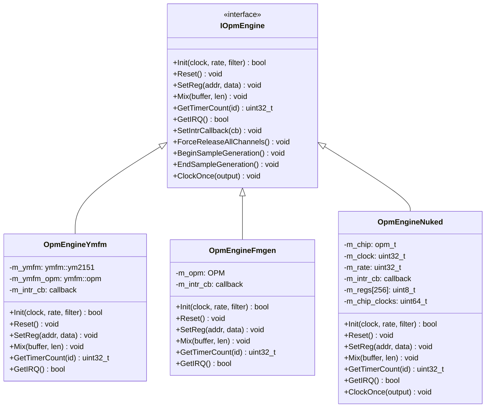
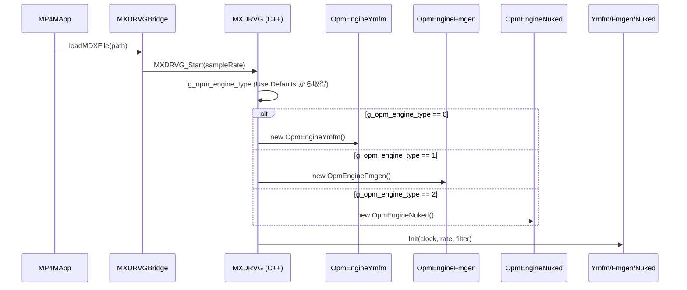
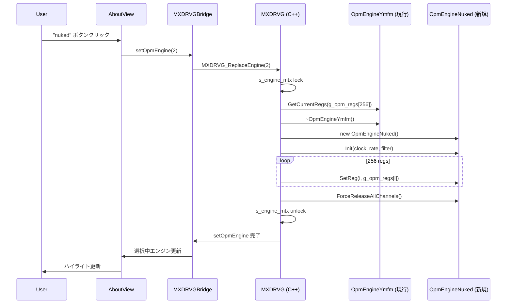
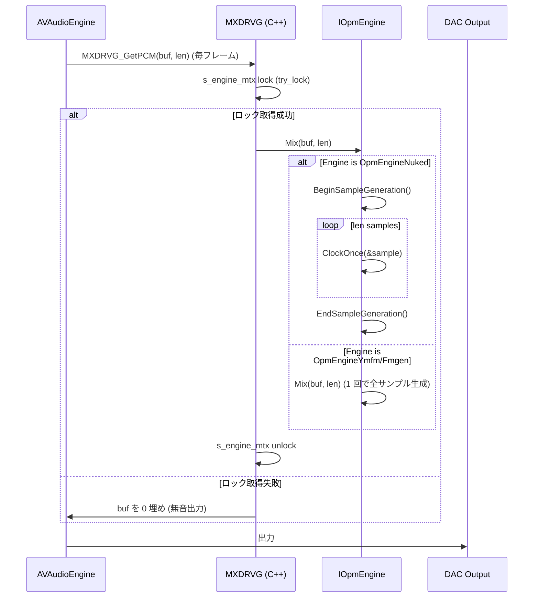
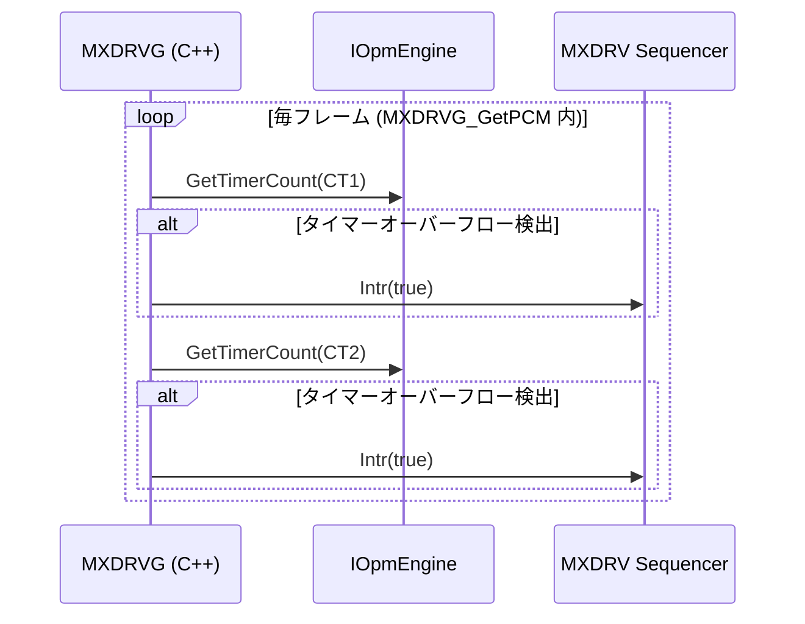

# REQ-007 設計書: Nuked OPM エンジン統合 (再チャレンジ)

REQ-007 で定義した要件を実現するコンポーネント構成・データフロー・ファイル変更計画をまとめる。
各コンポーネントに REQ-ID マッピングを明記する。

## 1. アーキテクチャ概要

### 既存アーキテクチャ (REQ-006 失敗前)

```
[MDX/PDX]
    ↓
[MXDRVG] ─── g_engine (IOpmEngine*)
                ├── OpmEngineYmfm   (サンプル単位: Mix(buffer, len))
                └── OpmEngineFmgen  (サンプル単位: Mix(buffer, len))
    ↓
[DAC] → [Audio Engine] → [Speaker]
```

### REQ-007 設計後 (サイクルモード対応)

```
[MDX/PDX]
    ↓
[MXDRVG] ─── g_engine (IOpmEngine*)
                ├── OpmEngineYmfm   (Mix(buffer, len) サンプル単位)
                ├── OpmEngineFmgen  (Mix(buffer, len) サンプル単位)
                └── OpmEngineNuked  (ClockOnce(output) サイクル単位)
                      ↓
                opm_t (Nuked OPM 内部状態)
    ↓
[DAC] → [Audio Engine] → [Speaker]
```

**ポイント**: `IOpmEngine` インターフェースを拡張してサイクルモード (ClockOnce) と サンプルモード (Mix) を提供。既存エミュレータは Mix のみ新規エミュレータは ClockOnce で Nuked OPM のサイクル API に対応する。

## 2. クラス図



### REQ-ID マッピング

| クラス | 充足 REQ-ID | 備考 |
|--------|------------|------|
| `IOpmEngine` | REQ-007-01, REQ-007-08 | 新メソッド (ClockOnce, GetTimerCount, BeginSampleGeneration, EndSampleGeneration) 追加 |
| `OpmEngineYmfm` | (既存) | デフォルト実装継承、修正不要 |
| `OpmEngineFmgen` | (既存) | デフォルト実装継承、修正不要 |
| `OpmEngineNuked` | REQ-007-03, REQ-007-01, REQ-007-08 | 新規実装、ClockOnce と GetTimerCount をオーバーライド |

## 3. シーケンス図

### 3.1 アプリ起動時 (エンジン初期化)



### 3.2 エンジン切替時 (ユーザー操作)



### 3.3 サンプル生成 (オーディオレンダリング)



### 3.4 タイマー通知



## 4. ファイル変更計画

### 4.1 新規ファイル

| ファイルパス | 充足 REQ-ID | 内容 |
|------------|------------|------|
| `Vendor/NukedOPM/opm.c` | REQ-007-02 | Nuked OPM コア実装 (約 2241 行) |
| `Vendor/NukedOPM/opm.h` | REQ-007-02 | Nuked OPM API (約 289 行) |
| `Vendor/NukedOPM/LICENSE` | REQ-007-02, REQ-007-06 | LGPL 2.1 全文 (約 504 行) |
| `Vendor/NukedOPM/README.md` | REQ-007-02 | 取り込み元 URL と更新日 |
| `Vendor/NukedOPM/OpmEngineNuked.h` | REQ-007-03, REQ-007-01, REQ-007-08 | IOpmEngine 実装 (約 250 行) |
| `MP4M/Resources/THIRD_PARTY_LICENSES/NukedOPM.txt` | REQ-007-06 | アプリ同梱用 LICENSE 全文 |
| `evidence/nuked-opm-validation/README.md` | REQ-007-09 | 検証結果記録 |
| `evidence/nuked-opm-regression/README.md` | REQ-007-10 | 非回帰テスト結果記録 |

### 4.2 変更ファイル

| ファイルパス | 充足 REQ-ID | 変更内容 |
|------------|------------|---------|
| `Vendor/ymfm/IOpmEngine.h` | REQ-007-01, REQ-007-08 | 新メソッド追加 (ClockOnce, BeginSampleGeneration, EndSampleGeneration, GetTimerCount) |
| `Vendor/ymfm/OpmEngineYmfm.h` | REQ-007-01 | GetTimerCount オーバーライド追加 |
| `Vendor/gamdx/jni/fmgen/OpmEngineFmgen.h` | REQ-007-01 | GetTimerCount オーバーライド追加 |
| `Vendor/gamdx/jni/mxdrvg/mxdrvg_core.h` | REQ-007-04, REQ-007-08 | `MXDRVG_ReplaceEngine` 追加、`g_opm_engine_type` 0/1/2 ルーティング |
| `MP4M/Bridge/MXDRVGBridge.mm` | REQ-007-04 | `setOpmEngine` を `MXDRVG_ReplaceEngine` 経由に |
| `MP4M/Views/AboutView.swift` | REQ-007-05, REQ-007-06 | 3 ボタン切替 UI + LGPL 2.1 ライセンス表示 |
| `project.yml` | REQ-007-07 | `Vendor/NukedOPM/opm.c` 追加、ヘッダ検索パス追加 |
| `MP4M/Resources/Info.plist` | (バージョン上げ) | 2.6.0 → 2.7.0 |
| `technical_docs/CHANGELOG.md` | (バージョン上げ) | 2.7.0 エントリ追加 |
| `technical_docs/CLAUDE.md` | (履歴反映) | Nuked OPM 統合の教訓追記 |

### 4.3 変更しないファイル

- `Vendor/ymfm/ymfm_fm.ipp` (CR-002 修正済み、再修正しない)
- `Vendor/ymfm/ymfm_opm.cpp`, `ymfm_opm.h` (ymfm 内部、Nuked OPM と無関係)
- `MP4M/ViewModels/`, `MP4M/Services/`, `MP4M/Models/` (Nuked OPM 統合と無関係)
- `MP4M/Views/FileSelectorView.swift` (CR-001 修正済み、再修正しない)

## 5. ビルド設定

### 5.1 project.yml 変更

```yaml
# 追加
sources:
  - Vendor/NukedOPM/opm.c   # REQ-007-02
  - Vendor/NukedOPM/OpmEngineNuked.h   # REQ-007-03 (ヘッダ)

# ヘッダ検索パス追加
headerSearchPaths:
  - Vendor/NukedOPM
  - Vendor/NukedOPM/..
```

### 5.2 ビルド手順

```bash
xcodegen generate
xcodebuild -project MP4M.xcodeproj -scheme MP4M -configuration Debug -derivedDataPath ./build/DerivedData build
```

成功条件: `** BUILD SUCCEEDED **`

## 6. データフロー

### 6.1 アプリ起動時

```
MP4MApp.init
  → MXDRVGBridge.init
    → MXDRVG_Start(sampleRate)
      → g_opm_engine_type = UserDefaults["mp4m_opmEngine"] ?? 0
      → g_engine = new OpmEngine(?)
      → g_engine->Init(clock=4000000, rate=44100, filter=true)
      → g_engine->SetIntrCallback(engine_intr_callback)
```

### 6.2 曲再生時 (毎フレーム 44100Hz)

```
AVAudioSourceNode.render(...)
  → MXDRVG_GetPCM(buffer, len=4410)  // 10ms 単位
    → s_engine_mtx.try_lock()
    → g_engine->Mix(buffer, len)
      → if OpmEngineNuked: loop len { OPM_Clock(...) }
      → else: ymfm/fmgen 一括処理
    → MXDRVG 内タイマー処理: g_engine->GetTimerCount(CT1/CT2)
    → s_engine_mtx.unlock()
  → Audio Engine → スピーカー
```

### 6.3 エンジン切替時

```
AboutView "nuked" ボタンクリック
  → setOpmEngine(2)
    → s_engine_mtx.lock()
    → g_opm_regs[256] に g_engine の全レジスタ保存
    → delete g_engine
    → g_engine = new OpmEngineNuked()
    → g_engine->Init(...)
    → g_engine->SetIntrCallback(...)
    → 256 レジスタを g_engine->SetReg(addr, data) で再生
    → g_engine->ForceReleaseAllChannels()
    → UserDefaults["mp4m_opmEngine"] = 2
    → s_engine_mtx.unlock()
```

## 7. バージョン計画

- **2.6.0** (現在): CR-001 + CR-002 リリース
- **2.7.0** (REQ-007 完了後): Nuked OPM 統合リリース
  - マイナーバージョンアップ: 機能追加 (Nuked OPM エンジン)
  - メジャーバージョンアップ (3.0.0) ではない: 後方互換性維持 (既存 ymfm/fmgen 動作変化なし)

## 8. リスクと対策

| リスク | 対策 | 担当 REQ |
|--------|------|---------|
| 過去 REQ-006 と同じ失敗 | IOpmEngine 拡張で根本解決 | REQ-007-01 |
| エンジン切替時のクラッシュ | ミューテックス保護 + DAC ミュート + レジスタ再生 | REQ-007-04 |
| Nuked OPM タイマー精度 | GetTimerCount 抽象化、3 エンジン同一 API | REQ-007-08 |
| LGPL 2.1 義務違反 | AboutView + アプリ同梱 LICENSE 全文 | REQ-007-06 |
| 既存エンジンへの副作用 | REQ-007-10 で非回帰テスト必須化 | REQ-007-10 |

## 9. 実装順序

1. **REQ-007-02**: Nuked OPM ソース取得 (`Vendor/NukedOPM/` 配下)
2. **REQ-007-01**: IOpmEngine 拡張 (新メソッド追加)
3. **REQ-007-03**: OpmEngineNuked アダプタ実装
4. **REQ-007-07**: ビルド設定 (`project.yml`)
5. **REQ-007-08**: タイマー処理統一 (`GetTimerCount`)
6. **REQ-007-04**: MXDRVG_ReplaceEngine 実装
7. **REQ-007-05**: 3 エンジン切替 UI
8. **REQ-007-06**: LGPL 2.1 ライセンス表示
9. **REQ-007-09**: 検証 (KNA + SC88 シリーズ)
10. **REQ-007-10**: 非回帰テスト
11. バージョン上げ (2.6.0 → 2.7.0) + CHANGELOG + CLAUDE.md

## 10. 完了基準

- [ ] 上記 11 ステップすべて完了
- [ ] ビルド成功 (BUILD SUCCEEDED)
- [ ] ymfm/fmgen 動作が CR-002 適用後と同等
- [ ] Nuked OPM で KNA03.MDX, SC88_036.MDX 正常再生
- [ ] 3 エンジン切替 UI 動作
- [ ] LGPL 2.1 ライセンス表示
- [ ] UserDefaults 永続化動作
- [ ] コミット分割 (1 コミット = 1 論理変更)
- [ ] push 完了
